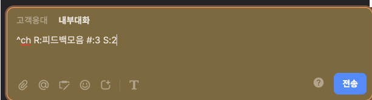

# channel-easy-clipper


## Summary

Channel Open Api 와 Webhook을 사용해서 유저에게 받은 메시지를 한  그룹 채팅방에 모으는 어플리케이션입니다.

채널톡을 이용해서 사이드 프로젝트의 MVP 버전 피드백을 수합하던 중 유저의 피드백을 한 곳에 모아두면 보기 좋을 것 같아 만들었습니다.

<b>^ch</b> 키워드를 통해 유저 채팅방에서 메시지를 그룹채팅방으로 복사해 올 수 있습니다.

### 옵션
- #: 가져오고 싶은 메시지의 개수를 지정합니다.
- S: 가장 최신 기준 몇번째 메시지부터 가져올지 지정합니다.
- R: 메시지를 옮겨가고 싶은 그룹 채팅방 이름을 지정합니다.




## How to run

1. 프로젝트에 사용되는 디펜던시를 설치합니다.

```
npm i
```

2. `.env.example` 예시를 참고하여 open api를 사용할 수 있도록 access-key, access-secret을 추가합니다. 필요한 키값은 https://developers.channel.io/docs/what-is-open-api 를 참고하여 생성해주세요. 기본 설정들(키워드 등)을 변경할 수도 있습니다.


3. Webhook 을 쏠 수 있도록 https://developers.channel.io/docs/what-is-webhook 를 참고하여 url을 등록해둡니다. url은 나중에 수정할 수 있습니다.

4. Webhook을 받기 위해서는 로컬 서버로 사용할 수 없으므로, ngrok이나 heroku 등을 사용해서 로컬 서버를 인터넷으로 서빙해주세요. 그 후 해당 url을 Channel의 Webhook에 등록합니다.


5. 옮겨오고 싶은 메시지가 있는 유저 채팅방에서 키워드를 사용해보세요. `내부대화` 기능을 사용해야 유저에게 키워드가 전송되지 않습니다!
